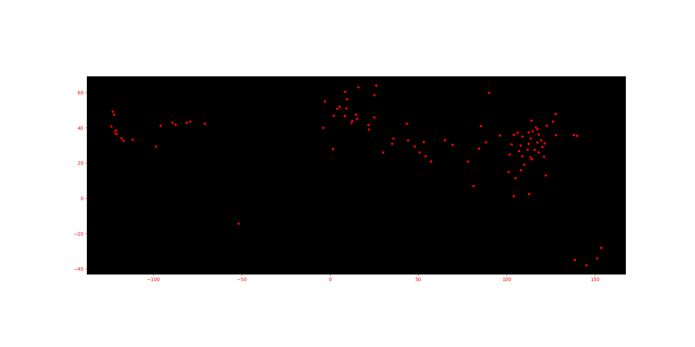
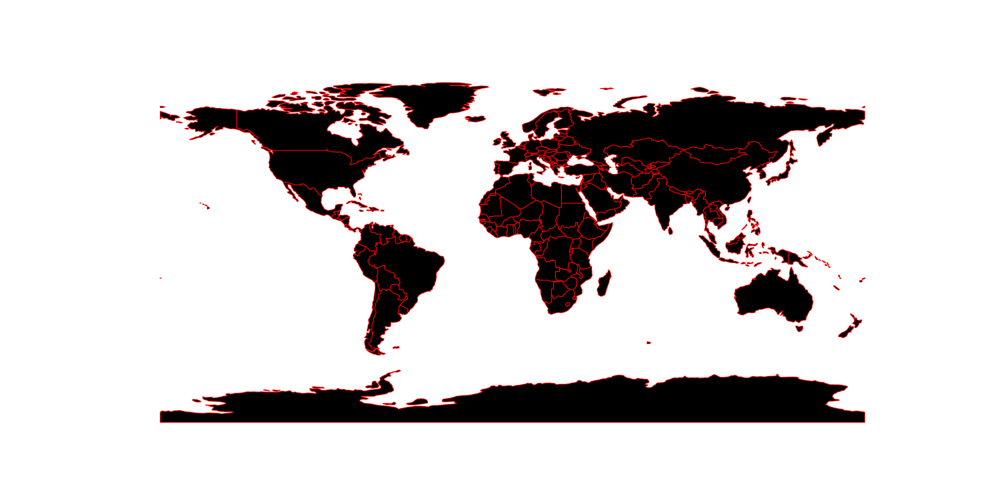
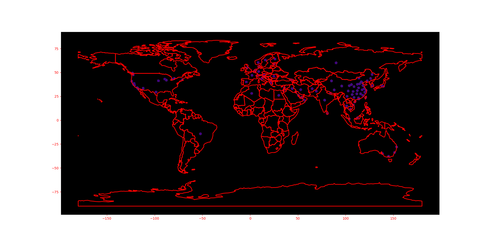

# Detecting and Visualizing covid-19
Small example of data analysis and visualization for coronavirus dataset

## Packages
<table class="tg">
  <tr>
    <th class="tg-yw4l"><b>Name</b></th>
    <th class="tg-yw4l"><b>Description</b></th>
    <th class="tg-yw4l"><b>Link</b></th>
  </tr>
  
  <tr>
    <td class="tg-yw4l">NumPy</td>
    <td class="tg-yw4l">a powerful N-dimensional array object</td>
    <td class="tg-yw4l"><a href="https://pypi.org/project/numpy/">
      
PyPI

    </a></td>
  </tr>
  
  <tr>
    <td class="tg-yw4l">Matplotlib</td>
    <td class="tg-yw4l">Matplotlib is a comprehensive library for creating static, animated, and interactive visualizations in Python.</td></td>
    <td class="tg-yw4l"><a href="https://pypi.org/project/matplotlib/">
     
PyPI

    </a></td>
  </tr>

<tr>
    <td class="tg-yw4l">Pandas</td>
    <td class="tg-yw4l">pandas is a Python package that provides fast, flexible, and expressive data structures designed to make working with structured (tabular, multidimensional, potentially heterogeneous) and time series data both easy and intuitive. It aims to be the fundamental high-level building block for doing practical, real world data analysis in Python. Additionally, it has the broader goal of becoming the most powerful and flexible open source data analysis / manipulation tool available in any language. It is already well on its way toward this goal.</td></td>
    <td class="tg-yw4l"><a href="https://pypi.org/project/pandas/">
     
PyPI

    </a></td>
 </tr>
  
  <tr>
    <td class="tg-yw4l">Geopandas</td>
    <td class="tg-yw4l">GeoPandas is a project to add support for geographic data to pandas objects.</td></td>
    <td class="tg-yw4l"><a href="https://pypi.org/project/geopandas/">
     
PyPI

    </a></td>
  </tr>
  
  <tr>
    <td class="tg-yw4l">Seaborn</td>
    <td class="tg-yw4l">Seaborn is a library for making statistical graphics in Python. It is built on top of matplotlib and closely integrated with pandas data structures.</td></td>
    <td class="tg-yw4l"><a href="https://pypi.org/project/seaborn/">
     
PyPI

    </a></td>
  </tr>
  
  <tr>
    <td class="tg-yw4l">Ipython</td>
    <td class="tg-yw4l">Python provides a rich toolkit to help you make the most out of using Python interactively.</td></td>
    <td class="tg-yw4l"><a href="https://pypi.org/project/ipython/">
     
PyPI

    </a></td>
  </tr>
  
  <tr>
    <td class="tg-yw4l">Shapely</td>
    <td class="tg-yw4l">Manipulation and analysis of geometric objects in the Cartesian plane.</td></td>
    <td class="tg-yw4l"><a href="https://pypi.org/project/Shapely/">
     
PyPI

    </a></td>
  </tr>

